# EXNO:4-DS
# AIM:
To read the given data and perform Feature Scaling and Feature Selection process and save the
data to a file.

# ALGORITHM:
STEP 1:Read the given Data.
STEP 2:Clean the Data Set using Data Cleaning Process.
STEP 3:Apply Feature Scaling for the feature in the data set.
STEP 4:Apply Feature Selection for the feature in the data set.
STEP 5:Save the data to the file.

# FEATURE SCALING:
1. Standard Scaler: It is also called Z-score normalization. It calculates the z-score of each value and replaces the value with the calculated Z-score. The features are then rescaled with x̄ =0 and σ=1
2. MinMaxScaler: It is also referred to as Normalization. The features are scaled between 0 and 1. Here, the mean value remains same as in Standardization, that is,0.
3. Maximum absolute scaling: Maximum absolute scaling scales the data to its maximum value; that is,it divides every observation by the maximum value of the variable.The result of the preceding transformation is a distribution in which the values vary approximately within the range of -1 to 1.
4. RobustScaler: RobustScaler transforms the feature vector by subtracting the median and then dividing by the interquartile range (75% value — 25% value).

# FEATURE SELECTION:
Feature selection is to find the best set of features that allows one to build useful models. Selecting the best features helps the model to perform well.
The feature selection techniques used are:
1.Filter Method
2.Wrapper Method
3.Embedded Method

# CODING AND OUTPUT:
import pandas as pd
from scipy import stats
import numpy as np
df=pd.read_csv("/content/bmi.csv")
df.head()

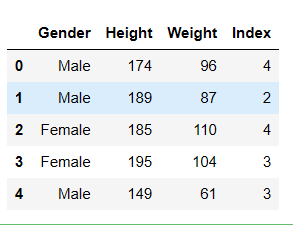

df.dropna()

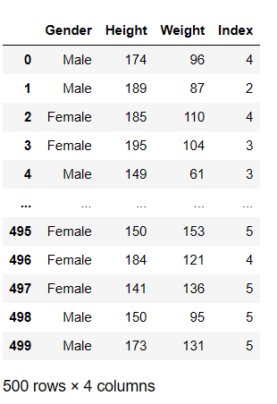

max_vals=np.max(np.abs(df[['Height','Weight']]))
max_vals

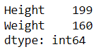

from sklearn.preprocessing import StandardScaler
sc=StandardScaler()
df[['Height','Weight']]=sc.fit_transform(df[['Height','Weight']])
df.head(10)

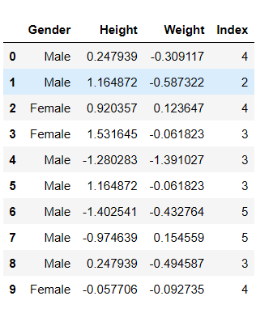

from sklearn.preprocessing import MinMaxScaler
scaler=MinMaxScaler()
df[['Height','Weight']]=scaler.fit_transform(df[['Height','Weight']])
df.head(10)

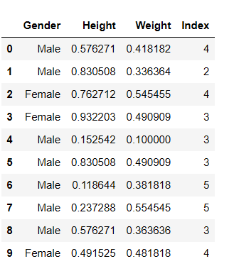

from sklearn.preprocessing import Normalizer
scaler=Normalizer()
df[['Height','Weight']]=scaler.fit_transform(df[['Height','Weight']])
df

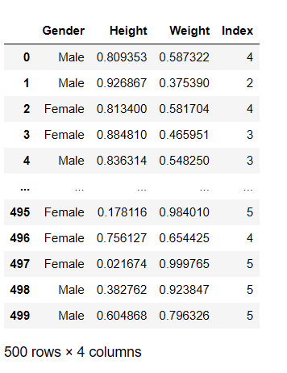

df1=pd.read_csv("/content/bmi.csv")
from sklearn.preprocessing import MaxAbsScaler
scaler=MaxAbsScaler()
df1[['Height','Weight']]=scaler.fit_transform(df1[['Height','Weight']])
df1

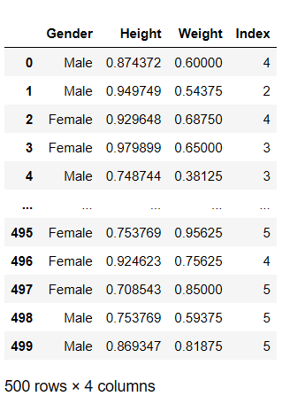

df2=pd.read_csv("/content/bmi.csv")
from sklearn.preprocessing import RobustScaler
scaler=RobustScaler()
df2[['Height','Weight']]=scaler.fit_transform(df2[['Height','Weight']])
df2.head()

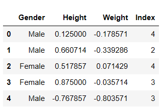

import pandas as pd
import numpy as np
import seaborn as sns
from sklearn.model_selection import train_test_split
from sklearn.neighbors import KNeighborsClassifier
from sklearn.metrics import accuracy_score,confusion_matrix
data=pd.read_csv('/content/income(1) (1).csv',na_values=[" ?"])
data

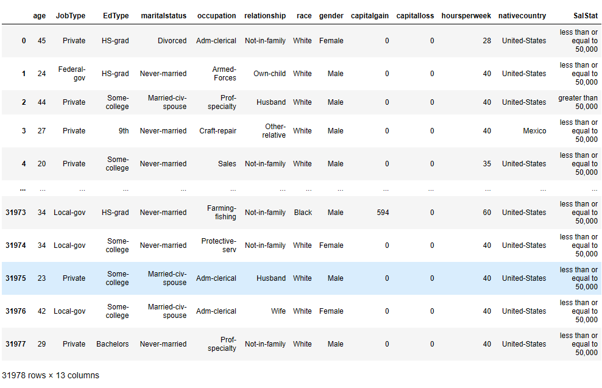

data.isnull().sum()

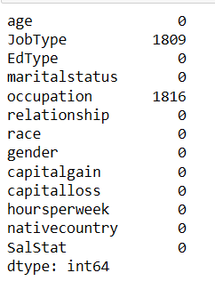

missing=data[data.isnull().any(axis=1)]
missing

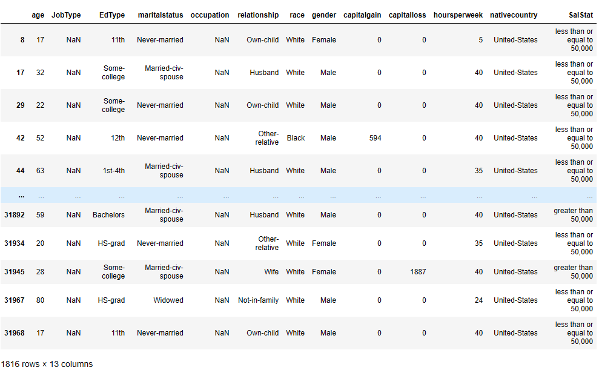

data2 = data.dropna(axis=0)
data2

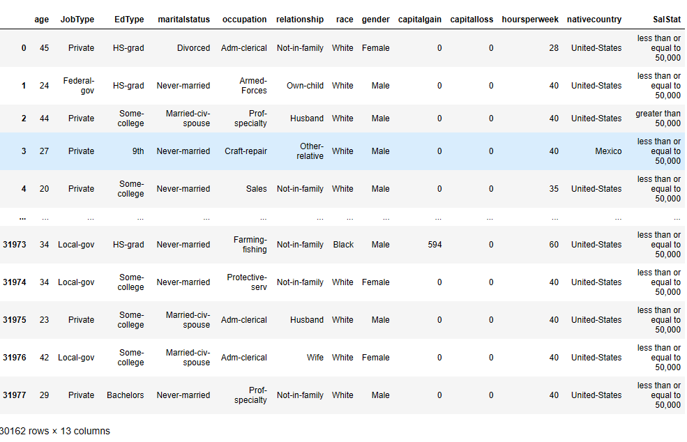

sal=data['SalStat']
data2['SalStat']=data2['SalStat'].map({' less than or equal to 50,000':0,' greater than 50,000':1})
print(data2['SalStat'])

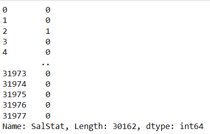

sal2=data2['SalStat']
dfs=pd.concat([sal,sal2],axis=1)
dfs

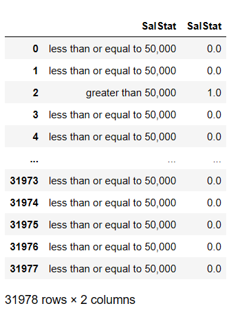

data2

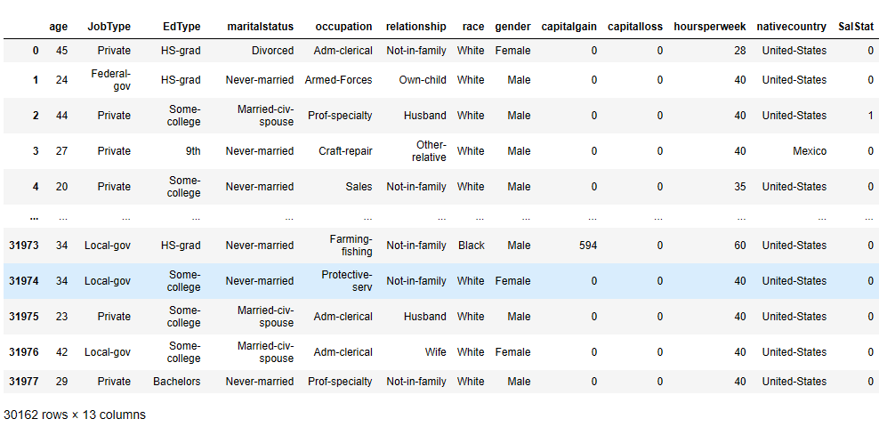

new_data=pd.get_dummies(data2, drop_first=True)
new_data

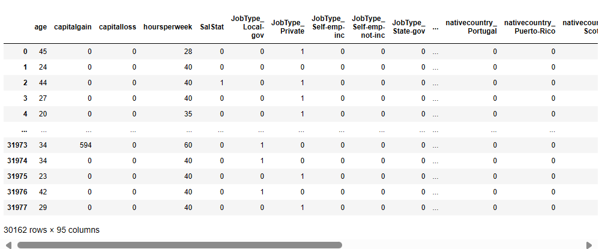
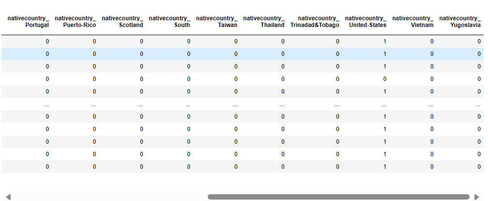

columns_list=list(new_data.columns)
print(columns_list)

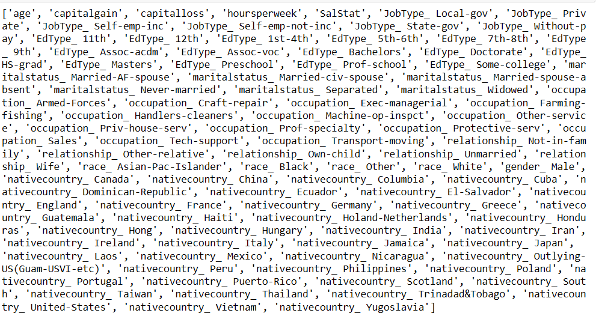

features=list(set(columns_list)-set(['SalStat']))
print(features)

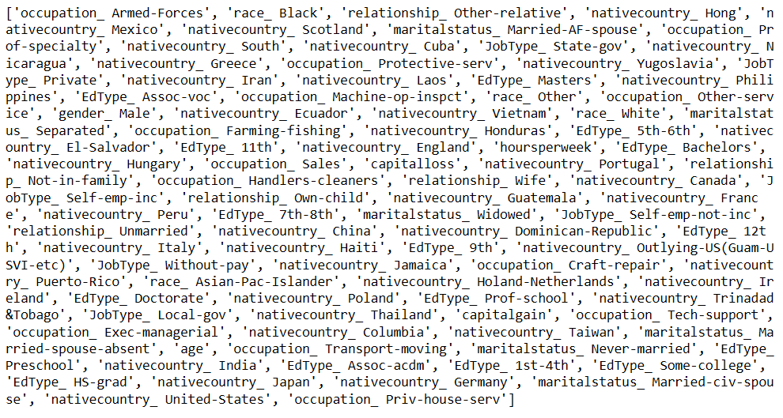

y=new_data['SalStat'].values
print(y)

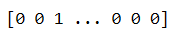

x = new_data[features].values
print(x)

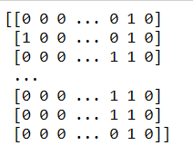

train_x,test_x,train_y,test_y = train_test_split(x,y,test_size=0.3, random_state=0)
KNN_classifier=KNeighborsClassifier(n_neighbors = 5)
KNN_classifier.fit(train_x,train_y)

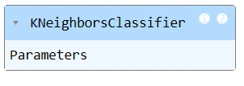

prediction = KNN_classifier.predict(test_x)
confusionMmatrix = confusion_matrix(test_y, prediction)
print(confusionMmatrix)

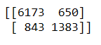

accuracy_score=accuracy_score(test_y, prediction)
print(accuracy_score)

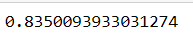

print('Misclassified samples: %d' % (test_y != prediction).sum())

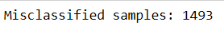

data.shape

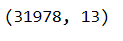

import pandas as pd
import numpy as np
from scipy.stats import chi2_contingency
import seaborn as sns
tips=sns.load_dataset('tips')
tips.head()

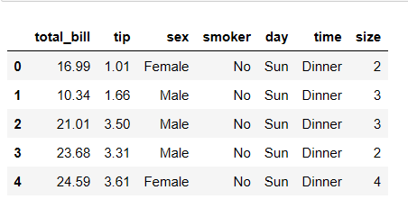

contingency_table=pd.crosstab(tips['sex'],tips['time'])
print(contingency_table)

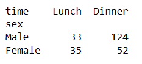

chi2, p, _, _ = chi2_contingency(contingency_table)
print(f"Chi-Square Statistic: {chi2}")
print(f"P-value: {p}")

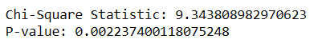

import pandas as pd
from sklearn.feature_selection import SelectKBest, mutual_info_classif, f_classif
data={
    'Feature1':[1,2,3,4,5],
    'Feature2': ['A','B','C','A','B'],
    'Feature3':[0,1,1,0,1],
    'Target' :[0,1,1,0,1]
}
df=pd.DataFrame(data)
X=df[['Feature1','Feature3']]
y=df['Target']
selector=SelectKBest(score_func=mutual_info_classif, k=1)
X_new = selector.fit_transform (X,y)
selected_feature_indices = selector.get_support(indices=True)
selected_features = X.columns[selected_feature_indices]
print("Selected Features:")
print(selected_features)

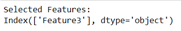

# RESULT:

To read the given data and perform Feature Scaling and Feature Selection process and save the data to a file is successful.